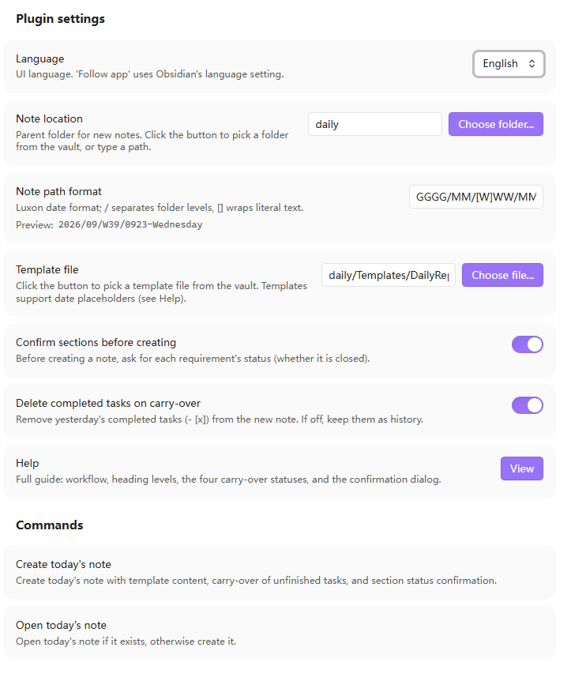

# Daily Report

An Obsidian plugin that extends the native Daily Notes plugin with:

- **Dynamic directory paths** - Generate daily note folders using Luxon date formats
- **Template rendering** - Use templates with date placeholders
- **Task carry-over** - Automatically carry over incomplete tasks from yesterday
- **Section-level confirmation** - Confirm whether requirements are closed even when all tasks are done


## Installation

1. Copy the `obsidian-daily-report` folder to your vault's `.obsidian/plugins/` directory
2. Enable the plugin in Obsidian (Settings > Third-party plugins > Community plugins > Enable Daily Report)
3. Configure the plugin settings (directory format, filename format, template path)

## Configuration

### Daily Path Format

Uses Luxon date format strings with `/` to separate directory levels:

```
YYYY/MM/[W]WW/MMDD
```

Example: `2026/09/[W]39/0922` → creates `2026/09/第39周/0922.md`

Common formats:
- `YYYY` - 4-digit year
- `MM` - Month (01-12)
- `DD` - Day (01-31)
- `WW` - Week number (01-53)
- `GGGG` - ISO year
- `cccc` - Weekday name (Monday, Tuesday...)
- `[text]` - Literal text in square brackets

### Template Path

Path to the template file in your vault, e.g.:

```
Templates/Daily Report.md
```

### Date Placeholders

Templates support three date placeholder formats:

| Format | Example | Output |
|--------|---------|--------|
| `**date:FORMAT**` | `**date:YYYY-MM-DD**` | `2024-01-15` |
| `${date:FORMAT}` | `${date:cccc}` | `Monday` |
| `{{date:FORMAT}}` | `{{date:GGGG-[W]WW}}` | `2024-[W]03` |

### Options

- **Confirm before create** - Show confirmation modal before creating daily note
- **Delete completed tasks** - Remove completed tasks (`- [x]`) from yesterday's note when carrying over

## Template Structure

The plugin uses a hierarchical template structure:

```markdown
## Fixed Section (template, daily)
  ### Specific Requirement (may carry over)
    #### Sub-task/Item (clear boundary)
      - Content...
      - [ ] Optional task marker
```

### Section Levels

| Level | Purpose | Carry-over |
|-------|---------|------------|
| `##` | Fixed template sections | Never carried over |
| `###` | Specific requirements | May carry over |
| `####` | Sub-tasks/Items | Part of parent section |

### Status Markers

Mark section status with HTML comments or strikethrough:

| Status | Marker | Carry-over |
|--------|--------|------------|
| **Pending** (in progress) | `<!-- req-status: pending -->` or no marker | Yes |
| **Verifying** (verifying) | `<!-- req-status: verifying -->` | Yes |
| **Done** (completed) | `~~Title~~` or `<!-- req-status: done -->` | No |
| **Cancelled** (dropped) | `<!-- req-status: cancelled -->` | No |

**Note**: Strikethrough (`~~title~~`) can only represent "done", not "cancelled". Use HTML comment for cancelled.

### Auto-completion

If all `####` sub-tasks under a `###` requirement are completed, the requirement is automatically marked as done and not carried over.

## Usage

### Create Today's Daily Report

1. Open command palette (Ctrl/Cmd+P)
2. Type "Create today's daily report"
3. Press Enter

### Workflow

```
Create Today's Daily Report
  │
  ├─ Read template → Render date placeholders → Generate today's note
  │
  ├─ Read yesterday's note
  │    │
  │    ├─ Parse sections and sub-tasks
  │    │
  │    └─ Check section status
  │         │
  │         ├─ All #### done → Auto-mark as done, skip
  │         ├─ Has pending #### → Ask user for confirmation
  │         ├─ Already done/cancelled → Skip
  │         └─ Show confirmation modal
  │
  ├─ Apply status decisions to yesterday's note
  │
  ├─ Carry over pending sections to today's note
  │
  └─ Save and open today's note
```

### Carry-over Rules

1. **Sections with `done` or `cancelled` status**: Not carried over
2. **Sections with `pending` or `verifying` status**:
   - All `####` sub-tasks completed → Auto-mark as done, not carried over
   - Has incomplete `####` sub-tasks → Carried over
3. **Section matching**:
   - If today's template has matching section: Insert under that section
   - If no matching section: Append to end of note

## Status Flow

```
                    ┌─────────────────────────────────────┐
                    │                                     │
                    ▼                                     │
              ┌──────────┐    ┌──────────┐    ┌──────────┐
              │ Pending  │───▶│ Verifying│───▶│   Done   │
              │(进行中)  │◀───│ (验证中)  │◀───│ (已完成)  │
              └──────────┘    └──────────┘    └──────────┘
                    │              │                │
                    │              │                │
                    ▼              ▼                │
              ┌──────────┐    ┌──────────┐          │
              │Cancelled │    │Cancelled │          │
              │(已取消)  │    │ (已取消)  │          │
              └──────────┘    └──────────┘          │
                    │                                     │
                    └─────────────────────────────────────┘
```

All statuses can be switched back and forth.

## Example Templates

### Default Template (English)

```markdown
# Daily Report - **date:YYYY-MM-DD**

## feature

### item-1

- [ ] task-1
- [ ] task-2

### item-2

- [ ] task-1
- [ ] task-2

## bugfix

### item-1

- [ ] task-1
- [ ] task-2

## summary

### item-1

- content
```

### Example Template (Chinese)

```markdown
# 日报 - **date:YYYY-MM-DD**

## 今日AI

### item-1

- [ ] 任务1
- [ ] 任务2

### item-2

- [ ] 任务1
- [ ] 任务2

## 外部支持

### item-1

- [ ] 任务1
- [ ] 任务2

### item-2

- [ ] 任务1
- [ ] 任务2

## 重要迭代

### item-1

- [ ] 任务1
- [ ] 任务2

### item-2

- [ ] 任务1
- [ ] 任务2

## 待修复的问题

### item-1

- [ ] 任务1
- [ ] 任务2

### item-2

- [ ] 任务1
- [ ] 任务2

## 每日总结

### item-1

- 内容
```

## Plugin Settings Screenshot



*Settings page showing daily path format, template path, and options*

## Development

```bash
# Install dependencies
pnpm install

# Development mode (watch)
pnpm dev

# Production build
pnpm build

# Type check
pnpm typecheck

# Run tests
pnpm test

# Lint
pnpm lint
```

## Dependencies

- `obsidian` - Obsidian plugin API (dev reference only)
- `luxon` - Date handling (bundled with Obsidian, no extra install needed)
- `esbuild` - Build tool
- `typescript` - Type safety

## License

MIT
